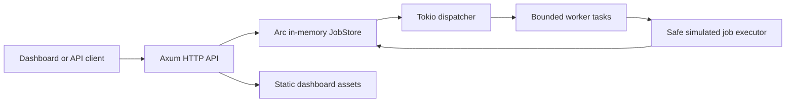

# Pulse Runner RS

Pulse Runner RS is a working prototype of a lightweight edge-style background job runner written in Rust. It exposes a small HTTP API, executes seeded demo jobs in a Tokio worker loop, deduplicates job submissions through idempotency keys, applies deterministic retry/backoff, keeps structured job history in memory, emits JSON tracing, and serves a compact operations dashboard.

This repository is intentionally database-free. Runtime state is held in a thread-safe in-memory store, so jobs and history disappear when the process restarts.


## Status

- Prototype status: usable locally for API and dashboard demos.
- Persistence: in-memory only.
- Job execution: simulated safe job kinds only. The runner never executes shell commands, user-provided scripts, or arbitrary code.
- Demo disclosure: seeded jobs are fictional telemetry operations using deterministic simulated delays and failures.

## Quickstart

```bash
cargo run
```

Open `http://127.0.0.1:8080` for the dashboard.

Queue a job:

```bash
curl -sS http://127.0.0.1:8080/api/jobs \
  -H 'content-type: application/json' \
  -d '{"kind":"heartbeat","payload":{"edge":"manual-01","work_units":1},"idempotency_key":"manual-01","max_attempts":3}'
```

Read APIs:

```bash
curl -sS http://127.0.0.1:8080/api/health
curl -sS http://127.0.0.1:8080/api/metrics
curl -sS http://127.0.0.1:8080/api/jobs
curl -sS http://127.0.0.1:8080/api/history
```

## Verified Commands

Verified locally on 2026-08-13 with Rust/Cargo 1.94.0:

```bash
cargo fmt --check              # passed
cargo test                     # passed: 7 tests
cargo clippy -- -D warnings    # passed
```

Runtime smoke check on `127.0.0.1:18080` returned HTTP 200 for `/api/health`, `/api/metrics`, and `/`.

## API

| Method | Path | Purpose |
| --- | --- | --- |
| `GET` | `/api/health` | Service status, version, and uptime. |
| `GET` | `/api/metrics` | Aggregate runner counters. |
| `GET` | `/api/jobs` | List all known jobs. |
| `POST` | `/api/jobs` | Queue a job. Reuses an existing job when the idempotency key already exists. |
| `GET` | `/api/jobs/{id}` | Read one job and its history. |
| `POST` | `/api/jobs/{id}/cancel` | Cancel a non-terminal job. |
| `GET` | `/api/history` | Flattened event history across jobs. |

`POST /api/jobs` accepts:

```json
{
  "kind": "sensor-rollup",
  "payload": {
    "region": "iad",
    "work_units": 3,
    "fail_until_attempt": 1
  },
  "idempotency_key": "rollup-iad-5m",
  "max_attempts": 4
}
```

Supported demo kinds are `heartbeat`, `sensor-rollup`, `webhook-delivery`, `cache-warm`, and `cleanup`. Other non-empty kinds are accepted and handled by the safe simulated executor.

## Architecture



Core modules:

- `src/http.rs`: routes, API errors, static dashboard wiring.
- `src/store.rs`: thread-safe in-memory jobs, idempotency index, metrics, and history.
- `src/runner.rs`: dispatcher, concurrency limit, deterministic backoff, safe simulated execution.
- `src/seed.rs`: fictional seeded demo jobs.

## Docker

The prototype API has no authentication. Keep the published port bound to the
loopback interface and do not expose it directly to a LAN or the public
internet.

```bash
docker build -t pulse-runner-rs .
docker run --rm -p 127.0.0.1:8080:8080 pulse-runner-rs
```

## Limitations

- No durable storage. Restarting the process clears all jobs, idempotency keys, and history.
- No distributed locking. This is a single-process runner.
- No authentication or multi-tenant authorization.
- Same-origin browser access only; cross-origin API access is not enabled.
- The dashboard is an operations demo, not a full administrative console.
- The simulated executor models timing and deterministic failures; it does not perform network calls or shell execution.

## License

Apache-2.0. See [LICENSE](LICENSE).
