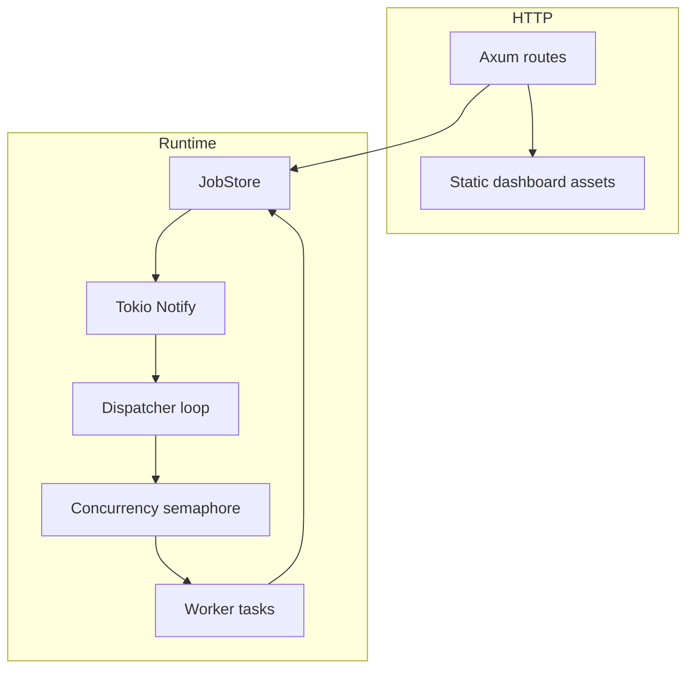

# Architecture

Pulse Runner RS is a single-process background job runner. The design keeps the prototype easy to run while preserving the operational surfaces expected from an edge-style worker: idempotent enqueueing, deterministic retries, bounded concurrency, structured job events, health and metric APIs, and a dashboard.

## Components



## Job Lifecycle

1. A client submits `POST /api/jobs`.
2. `JobStore` validates the request and checks the optional idempotency key.
3. If the key already exists, the existing job is returned with `deduplicated: true`.
4. If the key is new, a `pending` job is inserted with a `queued` history event.
5. The dispatcher claims the next ready pending job and marks it `running`.
6. A worker executes the safe simulated job.
7. Success marks the job `succeeded`.
8. Failure either schedules a deterministic retry or marks the job `failed` after `max_attempts`.

The retry delay is deterministic exponential backoff with no jitter:

```text
delay = min(base_ms * 2^(attempt - 1), max_ms)
```

The default is `base_ms = 500` and `max_ms = 10000`.

## State Model

State is stored in a `BTreeMap<String, Job>` protected by `tokio::sync::RwLock`. An idempotency `HashMap<String, String>` maps idempotency keys to job IDs. A `Notify` wakes the dispatcher when work is queued or rescheduled.

The in-memory store is deliberate for this working prototype. It removes setup friction and makes behavior visible, but it also means this runner is not durable. A production version should move jobs, idempotency keys, and events into durable storage before handling real workloads.

## Execution Safety

The runner does not execute shell commands, scripts, plugins, or arbitrary code. The executor only simulates known job behavior using payload fields such as `work_units`, `fail_until_attempt`, and `always_fail`. This keeps the demo deterministic and safe to run locally.

## Observability

The binary initializes JSON tracing with span fields for `job_id`, `kind`, and `attempt`. Each job records its own structured event history, and aggregate counters are exposed through `/api/metrics`.

## Future Work

- Durable storage for jobs, history, and idempotency.
- Authentication and operator roles.
- Graceful worker shutdown with drain controls.
- Dead-letter queues and replay endpoints.
- OpenTelemetry export.
- Dashboard filters and job detail drawers.
